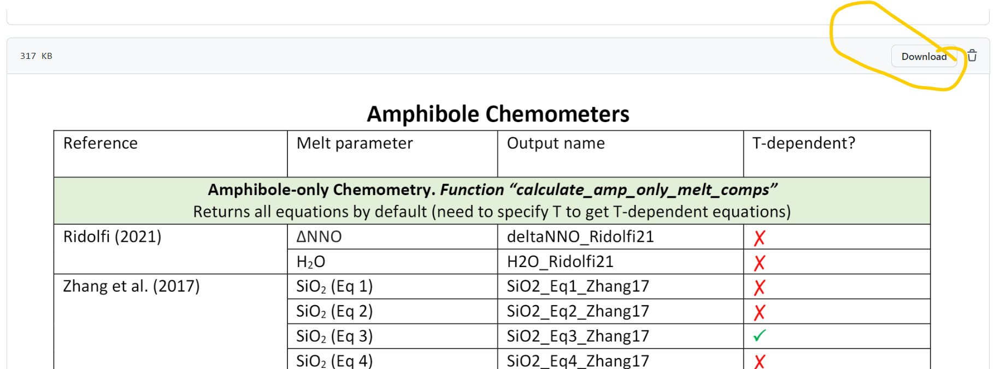

================================================
Available mineral and mineral-melt equations
================================================

You can find a pdf showing all the different equations on the Github page

https://github.com/PennyWieser/Thermobar/blob/main/docs/img/All_Phases_Docs_Merged.pdf

This is the best reference, as it will be updated as we add more models! You can easily download it using this 'download button', and then can ctrlF for your function of interest!

