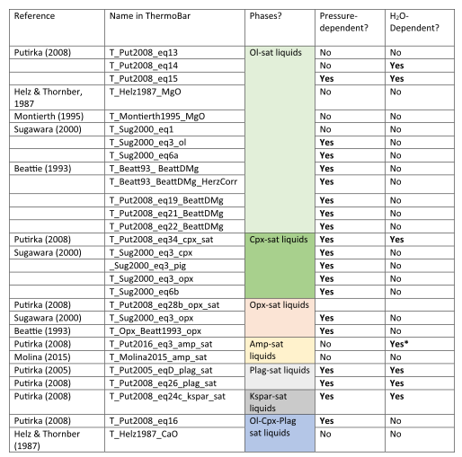
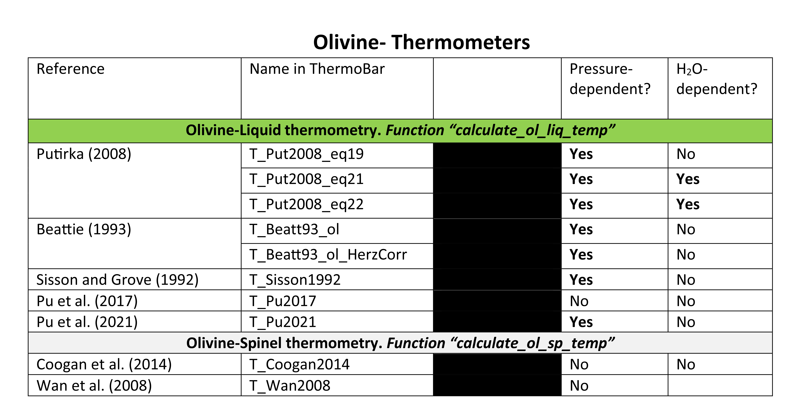
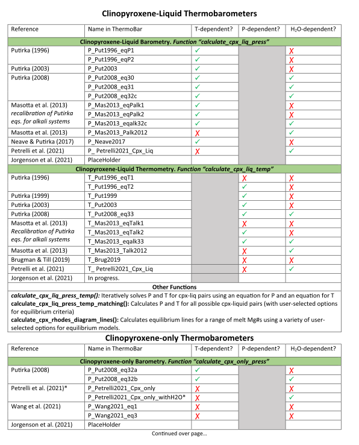
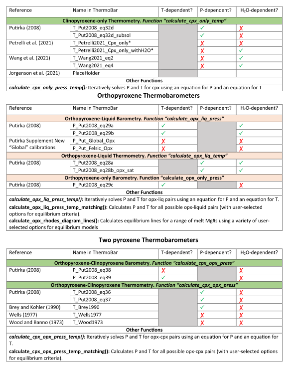
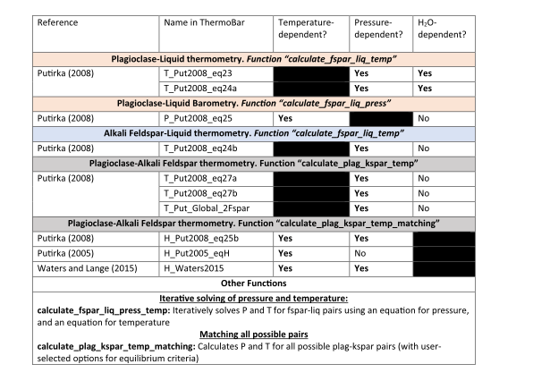
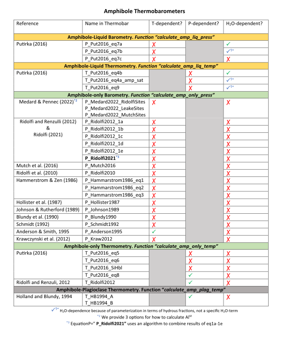
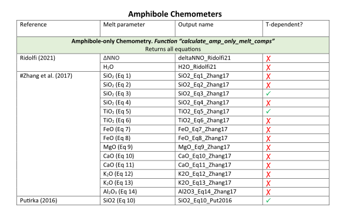

================================================
Available mineral and mineral-melt equations
================================================

.. contents::

Liquid equations
============================

Olivine equations
============================

Pyroxene equations
============================

Feldspar equations
============================

Amphibole equations
============================

