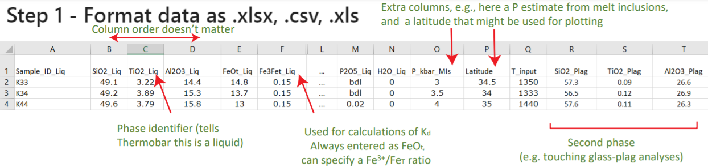

================
Importing Data
================

Users should format their compositional data as an Excel spreadsheet (.xlsx, .xls) or a comma separated values (.csv) file, 
with each analysis having its own row, and oxide components in wt%. 

The order of columns doesn’t matter, as the python pandas package will identify the column heading regardless of its location.

You can either put your spreadsheet in the same folder as the jupyter notebook, or specify a path to your data. 

The import_excel function recognises different phases based on the presence of an
underscore followed by a phase identifier in column headings. For example, the column heading
SiO2_Liq tells the code that this is the column containing the SiO2 content of the liquid/melt phase.

The following phase identifiers are used:

*  _Liq (Liquid)
*  _Cpx (Clinopyroxene)
*  _Opx (Orthopyroxene)
*  _Plag (Plagioclase Feldspar)
*  _Kspar (Potassium Feldspar)
*  _Amp (Amphibole)
*  _Sp (Spinel)

For example, here a screenshot of an excel spreadsheet containing paired liquid and plagioclase feldspar compositions. 
You can have as many other columns as you want (e.g., Latitude).

To use the import_excel function, you must provide the file name, file extension, and sheet name. In this example, the excel workbook
would have to be in the same folder as the notebook

.. code-block:: python

    out=pt.import_excel('File_Name.xlsx', sheet_name="Sheet1", suffix="_Opx")

If you want to put it in a different folder, specify a path first:

.. code-block:: python

    from pathlib import Path
    input_path = Path(r"C:\Users\penny")
    out=pt.import_excel(path=input_path, file_name='File_Name.xlsx', sheet_name="Sheet1", suffix="_Opx")

The import excel function arranges the inputted columns into a dataframe for each mineral phase.  To address the fact that many literature datasets have text values (strings) in certain cells (e.g., bdl, n.d, NA, N/A), Thermobar automatically replaces any string in an oxide columns with zeros. If a given column heading is absent, Thermobar also fills this column with zeros.  For simplicity, and to create a uniform output structure, if the inputted spreadsheet only contains columns with the headings "\textunderscore Liq", the returned dataframes for other phases will consist entirely of zeros. These various dataframes are then packaged together into a Dictionary (can be thought of like an Excel spreadsheet with each mineral having its own sheet), and this dictionary is returned from the function (in the above code snippet, we call this dictionary "out").

Users then need to extract the phases they are interested in from this dictionary. Say, you want to extract a dataframe of your Plag compositions, you need to use the name of the dictionary and then the name of the "key" in square brackets, which is the phase identifier with an s added on the end. Here, we call this extracted dataframe of Plags "my Plags":

.. code-block:: python

    myPlags=out['Plags']

Similarly, we would extract liquids using:

.. code-block:: python

    myLiqs=out['Liqs']

You can also extract a dataframe containing all the columns you inputted using the key "my input":
.. code-block:: python

    myInput=out['my_input']

After importing data, we recomend you inspect each variable before using it, using the python .head() function:

.. code-block:: python

    myLiqs.head()

This will print the first 5 rows of the variable. You should check that no columns you expected to have numbers in are filled with zeros. This might happen if you have funny characters in your column headings (e.g., Si(zero)2 instead of SiO2, or spaces before oxide names (e.g., ...SiO2).

Preserving Sample Names
=========================
If you want to keep your sample names attached to your oxide compositions, you need to import them as "Sample_ID_..." where the dots are the phase identifier. E.g., for Cpx you need to have a column labelled "Sample_ID_Cpx"

One Mineral type (e.g, just Liquids)
====================================
If you are only loading in a single phase, not paired analyses, you do not actually need to add the phase identifiers to your excel file. You can just have the oxide names, and then when you read in the data using the import_excel function, you specify the phase identifier as a suffix. E.g., here, we are reading in a spreadsheet of Opx compositions, with column headings SiO2, TiO2, etc.

.. code-block:: python

    out2=pt.import_excel('File_Name.xlsx', sheet_name="Sheet1", suffix="_Opx")

Treatment of FeO vs. Fe2O3
================================

For liquids, Thermobar allows users to specify how they partition Fe between ferrous and ferric iron, because equilibrium tests involving the partitioning of Fe$^{2+}$ and Mg between minerals and melt are sensitive to the proportion of Fe$^{3+}$.  To avoid ambiguity, such as in cases where XRF data is reported as Fe$_{2}O_{3}$, but the speciation is unknown compared to situations when the proportions of FeO and Fe$_2$O$_{3}$ are known, total FeO contents should be used in input spreadsheets and labelled "FeOt\textunderscore  Liq" (e.g., from EPMA, XRF data). To partition melt Fe between redox states, the input spreadsheet should contain a column labelled \python{Fe3Fet_Liq} specifying the decimal proportion of Fe$^{3+}$ in the liquid.  None of the models considered here are sensitive to user-entered Fe redox proportions in phases other than liquid. This Fe3Fet ratio can also be overwritten in the functions themselves.

Exporting Data to Excel
================================
Any time you have a dataframe, e.g. Plags2, you can save to excel as follows:
.. code-block:: python

    Plags2.to_excel('Whatever_name_you_want.xlsx')

